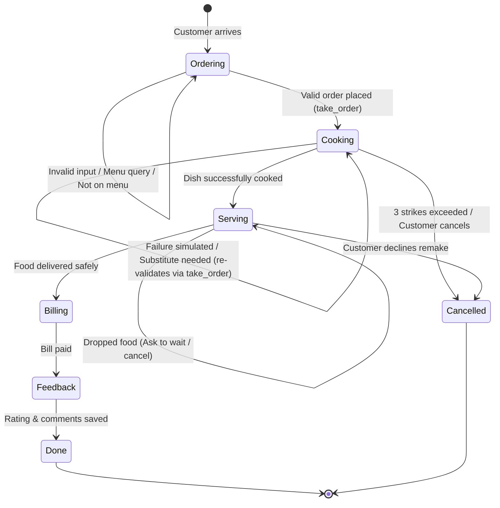

# 🍽️ Autonomous Restaurant AI Agent

An autonomous multi-stage restaurant conversational agent built using **LangGraph** and **Groq Cloud API** (`openai/gpt-oss-20b`). The agent orchestrates a full restaurant workflow—from order taking and kitchen cooking to food serving, billing, and feedback collection—complete with recovery mechanisms, state tracking, and failure handling.

---

## 🌟 Key Features

- **State Machine Architecture**: Built using `langgraph.graph.StateGraph` managing explicit transitions across order lifecycle stages.
- **Smart Two-Layer Order Extraction**:
  - **Primary**: Structured LLM JSON extraction via Groq API.
  - **Fallback**: Robust regex parsing with filler word removal (e.g., "plate", "bowl", "cup"), depluralization, and substring menu matching.
- **Realistic Restaurant Failure Simulations**:
  - **Quantity Exceeded**: Max 5 items per dish restriction.
  - **Kitchen Out of Stock / No Cook**: Simulates kitchen failures, requiring substitute dishes with automatic re-validation through the order gate.
  - **Dropped Food Incident**: Interactive recovery flow allowing customers to decide whether to wait for a remake or cancel.
  - **3-Strike Failure Cancellation**: Automatically cancels the order if unresolved kitchen/item issues reach 3 attempts.
- **Interactive Control CLI**:
  - Built-in simulation commands: `menu`, `toggle cook`, `toggle serve`, `state`, `reset`, and `exit`.
- **Dynamic Pricing & Receipts**: Computes item totals with tax calculation and itemized breakdowns.

---

## 🔄 Workflow State Machine

---

## 📋 Menu & Pricing

| Item | Category | Price |
| :--- | :--- | :--- |
| **Butter Chicken** | Mains | $12.00 |
| **Paneer Tikka** | Starters | $10.00 |
| **Dal Makhani** | Mains | $8.00 |
| **Naan** | Breads | $3.00 |
| **Garlic Naan** | Breads | $4.00 |
| **Biryani** | Mains | $11.00 |
| **Samosa** | Starters | $4.00 |
| **Pizza** | Mains | $9.00 |
| **Pasta** | Mains | $9.00 |
| **Pad Thai** | Mains | $10.00 |
| **Spring Rolls** | Starters | $5.00 |
| **Fried Rice** | Mains | $8.00 |
| **Manchurian** | Mains | $9.00 |
| **Gulab Jamun** | Desserts | $5.00 |
| **Lassi** | Beverages | $4.00 |

---

### In-App Commands

While interacting with the agent, you can type any of the following special commands:

- `menu` – Display the complete menu with prices and categories.
- `state` – Inspect the current internal LangGraph state (stage, items, total, strikes).
- `toggle cook` – Force toggle kitchen cook success/failure for testing.
- `toggle serve` – Force toggle serving/dropped food failure for testing.
- `reset` – Clear state and start a fresh session.
- `exit` or `quit` – Terminate the conversation.

---

